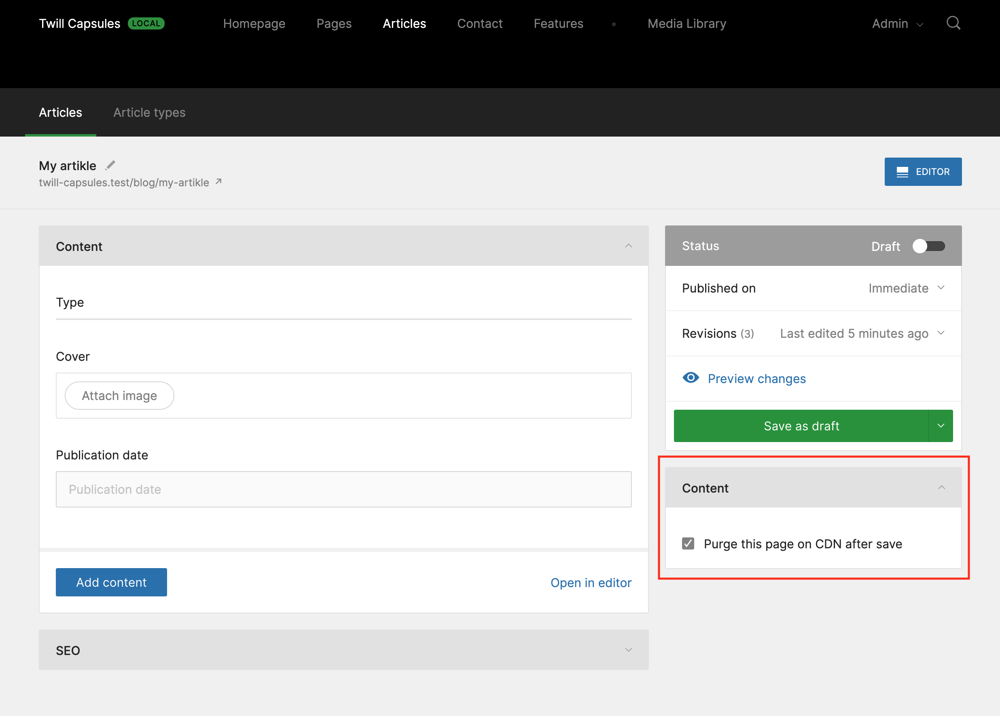
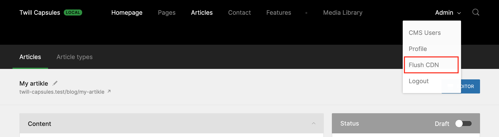

# Edge Purge Twill Capsule

This Twill Capsule is intended to enable developers handle Edge cache purges. 

## Screenshots

### CMS configuration




## Installing

### Require the Composer package:

``` bash
composer require area17/twill-edge-purge
```

### Publish the configuration

``` bash
php artisan vendor:publish --provider="A17\TwillEdgePurge\ServiceProvider"
```

## Enabling

This package is disabled by default. To enable it you just need to add to `.env`:

```dotenv
TWILL_EDGE_PURGE_ENABLED=true
```

And set some user allowed roles:

```dotenv
TWILL_EDGE_PURGE_ALLOWED_ROLES=SUPERADMIN,ADMIN
```

## Add to the user menu

In order to show the "Flush CDN" menu option, add the directive below to the `_user.blade.php` file:

```blade
@TwillEdgPurgeUserMenu
```

## Configure the CDN service

```dotenv
# Twill Edge Purge
TWILL_EDGE_PURGE_SERVICE=cloudfront

# CloudFront configuration
CLOUDFRONT_KEY=
CLOUDFRONT_SECRET=
CLOUDFRONT_DISTRIBUTION=
CLOUDFRONT_REGION=eu-west-1
```

## CDN Sevices 
All CDN Services configurations are deferred to the `config/services.php` file. You can copy here the ones that you will use:

```php
'cloudfront' => [
    'key' => env('CLOUDFRONT_KEY', env('AWS_ACCESS_KEY_ID')),
    'secret' => env('CLOUDFRONT_SECRET', env('AWS_SECRET_ACCESS_KEY')),
    'sdk_version' => env('CLOUDFRONT_SDK_VERSION', env('AWS_SDK_VERSION', '2017-10-30')),
    'region' => env('CLOUDFRONT_REGION', env('AWS_DEFAULT_REGION', 'us-east-1')),
    'distribution' => env('CLOUDFRONT_DISTRIBUTION', env('AWS_CLOUDFRONT_DISTRIBUTION')),
],
```

## Contribute

Please contribute to this project by submitting pull requests.
